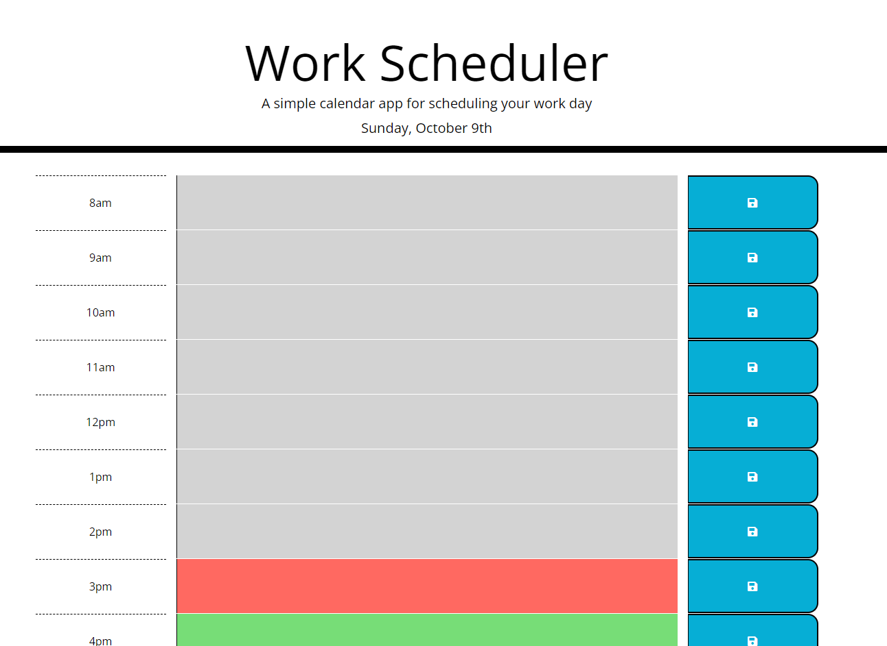

# Work Day Scheduler

Module 5 Challenge.

## Description

A daily planner to help employees manage their time effectively.

https://s-s-lee.github.io/work-scheduler/

## Website Preview

The image below is a screenshot of the Password Generator website.

## Contact

Contact [Susan](https://github.com/s-s-lee) if there are any issues or problems with the repo.

## Licenses

This repo use the [MIT License](https://github.com/s-s-lee/work-scheduler/blob/main/LICENSE).